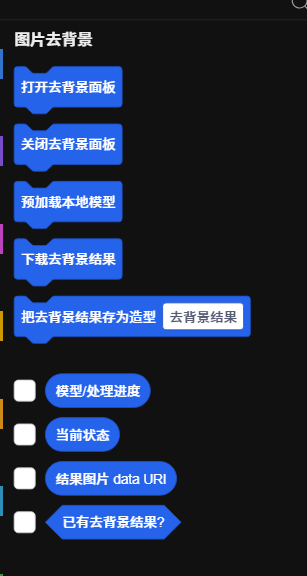

本扩展为 turbowarp(以及其分支） 提供了一个去背景工具面板，允许用户上传图片并利用本地 AI 模型自动移除背景，生成透明 PNG。    
同时提供积木，方便在 turbowarp (以及其分支） 项目中编程调用去背景功能、获取状态，并将结果直接保存为角色造型。     

原理：基于 [@imgly/background-removal](https://github.com/imgly/background-removal-js)  的 isnet_fp16 模型，在浏览器本地运行，去除背景。

积木预览：

