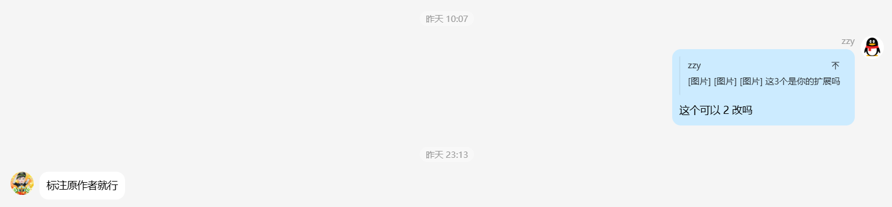

# 授权转载

# 授权2改

# 闲谈
## Q:'不想上学'是谁
A:
曾经是CCW社区内一位优秀的扩展开发者，开发过mdui弹窗、ExtensionsManager（扩展管理器）等
2025年6月：开始开发恶意扩展

大约在2025年6月，他的开发方向开始转向，着手开发恶意扩展。

2025年6月16日：首次被封禁
在2025年6月16日 17:27:43，他首次因违规行为被社区封禁。据他本人称，这次是因为“投币扩展”被封了7天。

2025年7月24日：加重处罚，封禁999天
在2025年7月24日 14:29:57，因违规行为加重，他被社区处以封禁999天的重罚。他自称这次是因为“防止举报”而被封30天。

封禁后：转向公开对抗
被封禁后，他曾尝试注册小号，但所有带“不想上学”名称的账号均被再次封禁。此后，他彻底转向公开对抗CCW社区。
> 来源整理ccw内文章
> 
>[其他来源](https://ccw-amazing-animals.fandom.com/zh/wiki/%E4%B8%8D%E6%83%B3%E4%B8%8A%E5%AD%A6)

这里转载的扩展皆安全
