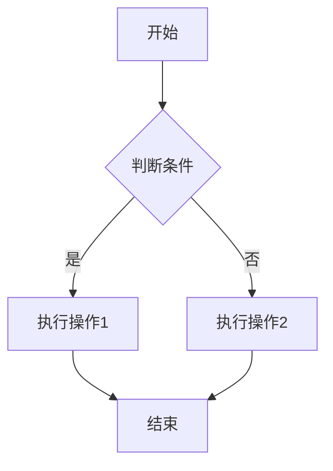
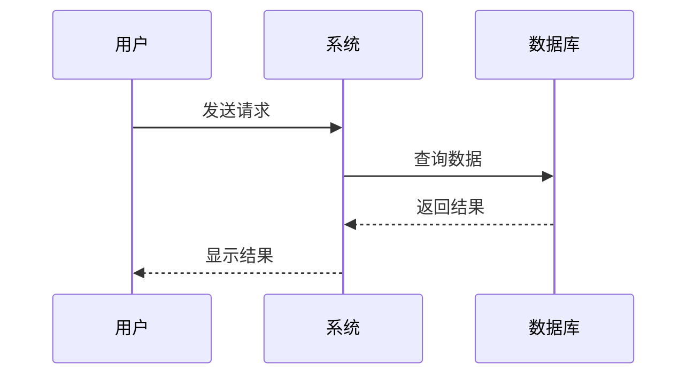
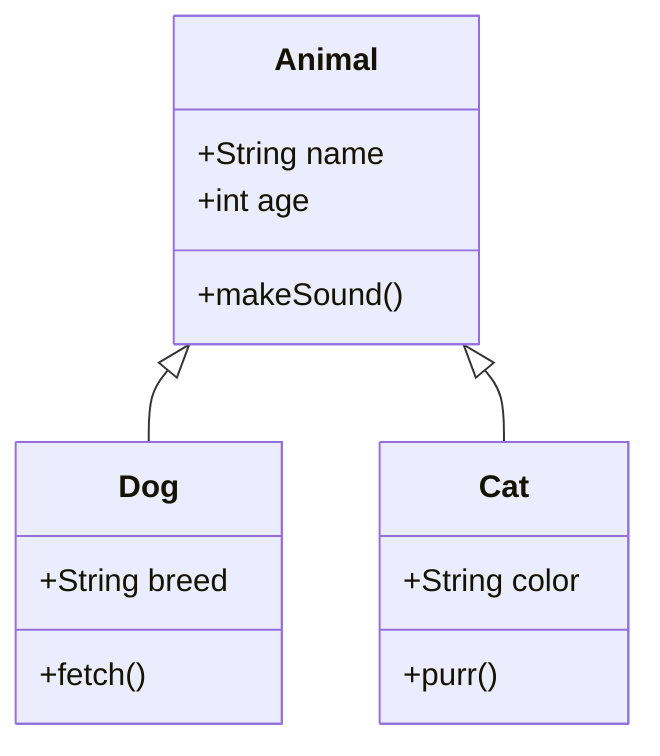
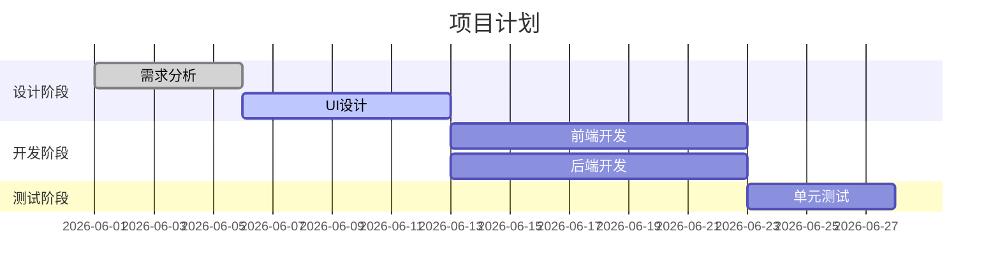

# Markdown 测试

## 1. LaTeX 数学公式测试

### 行内公式
这是一个行内公式：$E = mc^2$，这是爱因斯坦的质能方程。

### 块级公式

**二次方程求根公式：**
$$x = \frac{-b \pm \sqrt{b^2 - 4ac}}{2a}$$

**麦克斯韦方程组：**
$$\nabla \cdot \mathbf{E} = \frac{\rho}{\varepsilon_0}$$
$$\nabla \cdot \mathbf{B} = 0$$
$$\nabla \times \mathbf{E} = -\frac{\partial \mathbf{B}}{\partial t}$$
$$\nabla \times \mathbf{B} = \mu_0\mathbf{J} + \mu_0\varepsilon_0\frac{\partial \mathbf{E}}{\partial t}$$

**矩阵示例：**
$$A = \begin{pmatrix} a_{11} & a_{12} & a_{13} \\ a_{21} & a_{22} & a_{23} \\ a_{31} & a_{32} & a_{33} \end{pmatrix}$$

---

## 2. Mermaid 图表测试

### 流程图


### 时序图


### 类图


### 甘特图


---

## 3. Scratch Blocks 测试

由于 Scratch blocks 不是标准的 Markdown 语法，我将使用代码块和描述来展示：

### 事件积木
```scratchblocks
当 🏁 被点击
```

### 运动积木
```scratchblocks
移动 (10) 步
面向 (90 v) 方向
如果碰到边缘，就反弹
```

### 控制积木
```scratchblocks
重复执行 (10) 次
    移动 (5) 步
    等待 (0.1) 秒
结束

如果 <(分数) > [10]> 那么
    说 [恭喜！] (2) 秒
否则
    说 [继续努力！] (2) 秒
结束
```

### 变量与运算
```scratchblocks
将 [分数 v] 增加 (1)
将 [名字 v] 设为 [玩家1]
<(x 坐标) > [100]>
<((分数) * (2)) = [100]>
```

### 外观积木
```scratchblocks
说 [你好，世界！] (2) 秒
换成 [造型2 v] 造型
将颜色特效增加 (25)
```

---

## 综合示例：Scratch 游戏逻辑

```scratch
当 🏁 被点击
将 [分数 v] 设为 [0]
重复执行直到 <(分数) > [100]>
    如果 <按下 [空格键 v]?> 那么
        将 [分数 v] 增加 (10)
        播放声音 [收集 v]
    结束
    等待 (0.1) 秒
结束
说 [你赢了！] (3) 秒
```

---

以上就是 LaTeX、Mermaid 和 Scratch blocks 的 Markdown 测试！✨