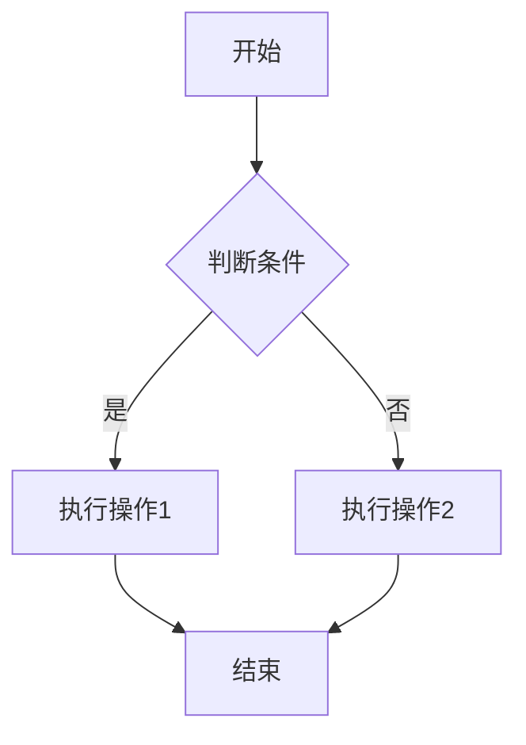
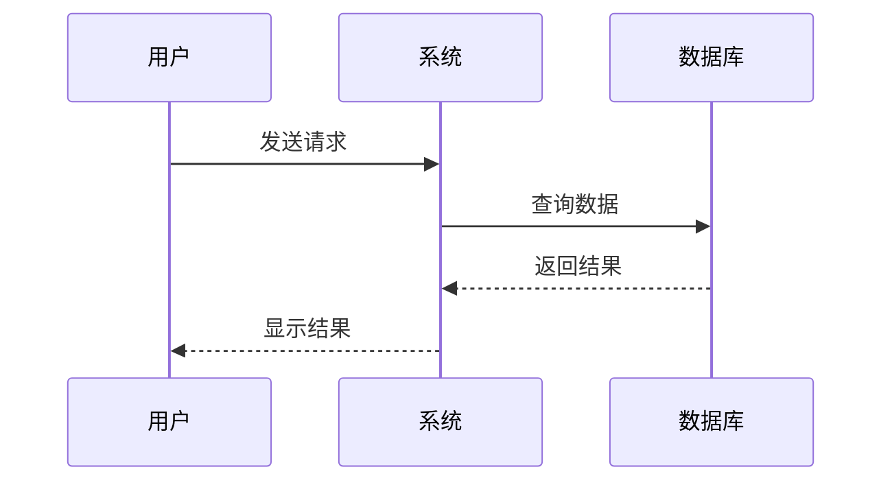
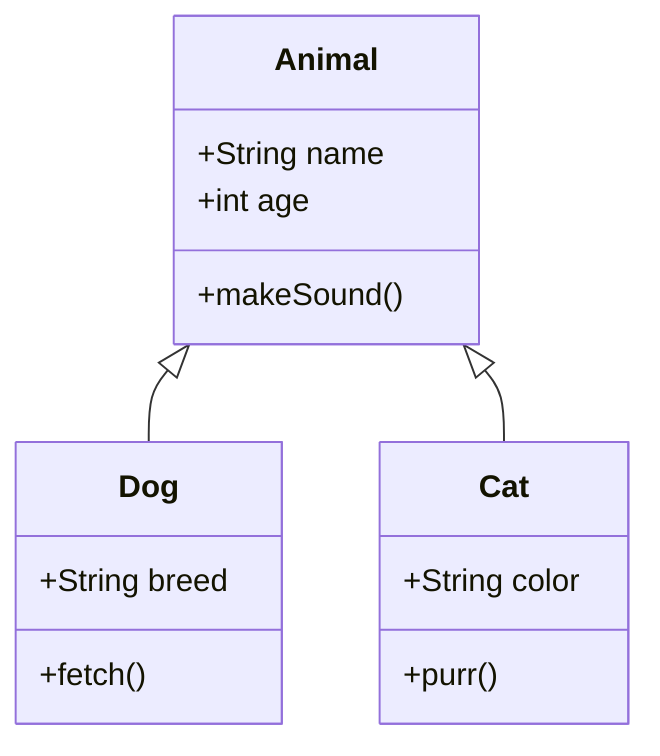
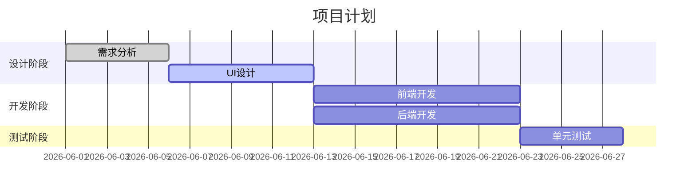
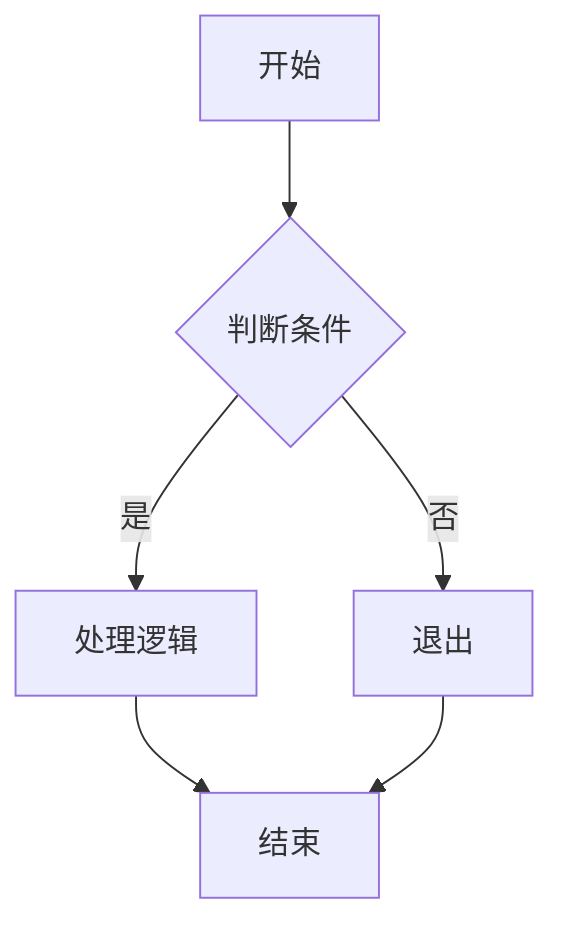
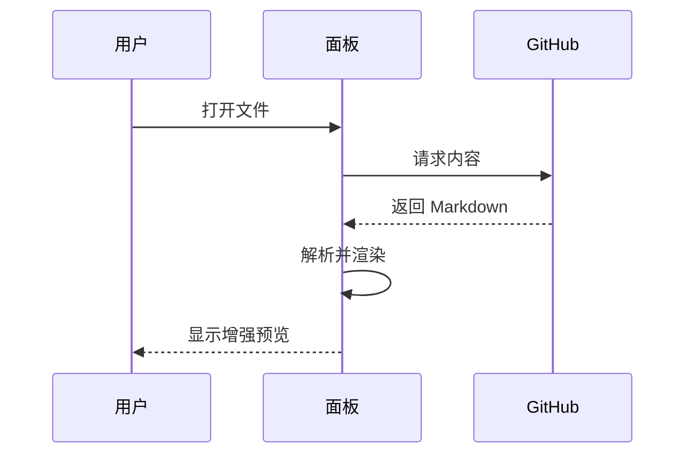

# Markdown 测试

## 1. LaTeX 数学公式测试

### 行内公式
这是一个行内公式：$E = mc^2$，这是爱因斯坦的质能方程。

### 块级公式

**二次方程求根公式：**
$$x = \frac{-b \pm \sqrt{b^2 - 4ac}}{2a}$$

**麦克斯韦方程组：**
$$\nabla \cdot \mathbf{E} = \frac{\rho}{\varepsilon_0}$$
$$\nabla \cdot \mathbf{B} = 0$$
$$\nabla \times \mathbf{E} = -\frac{\partial \mathbf{B}}{\partial t}$$
$$\nabla \times \mathbf{B} = \mu_0\mathbf{J} + \mu_0\varepsilon_0\frac{\partial \mathbf{E}}{\partial t}$$

**矩阵示例：**
$$A = \begin{pmatrix} a_{11} & a_{12} & a_{13} \\ a_{21} & a_{22} & a_{23} \\ a_{31} & a_{32} & a_{33} \end{pmatrix}$$

---

## 2. Mermaid 图表测试

### 流程图


### 时序图


### 类图


### 甘特图


---

## 3. Scratch Blocks 测试

由于 Scratch blocks 不是标准的 Markdown 语法，我将使用代码块和描述来展示：

### 事件积木
```scratchblocks
当 🏁 被点击
```

### 运动积木
```scratchblocks
移动 (10) 步
面向 (90 v) 方向
如果碰到边缘，就反弹
```

### 控制积木
```scratchblocks
重复执行 (10) 次
    移动 (5) 步
    等待 (0.1) 秒
结束

如果 <(分数) > [10]> 那么
    说 [恭喜！] (2) 秒
否则
    说 [继续努力！] (2) 秒
结束
```

### 变量与运算
```scratchblocks
将 [分数 v] 增加 (1)
将 [名字 v] 设为 [玩家1]
<(x 坐标) > [100]>
<((分数) * (2)) = [100]>
```

### 外观积木
```scratchblocks
说 [你好，世界！] (2) 秒
换成 [造型2 v] 造型
将颜色特效增加 (25)
```

---

## 综合示例：Scratch 游戏逻辑

```scratch
当 🏁 被点击
将 [分数 v] 设为 [0]
重复执行直到 <(分数) > [100]>
    如果 <按下 [空格键 v]?> 那么
        将 [分数 v] 增加 (10)
        播放声音 [收集 v]
    结束
    等待 (0.1) 秒
结束
说 [你赢了！] (3) 秒
```

---

以上就是 LaTeX、Mermaid 和 Scratch blocks 的 Markdown 测试！✨
<think> 用户要求“输出一个测试”。结合上下文，这个“测试”应该是指针对插件 `markdown-render-plus` 的测试代码或测试内容。用户可能是希望我生成一段 Markdown 内容来测试该插件的所有功能：代码高亮、数学公式、流程图、Scratch积木、树形目录、资源路径补全等。

我需要输出一段包含所有这些特性的 Markdown 文本，并且要包含提示信息，说明如何在 GitHub 面板中测试。
</think>
下面是一段专门用于测试插件所有功能的 Markdown 文本。你可以将其保存为 `.md` 文件，然后在 GitHub 面板 Pro+ 中打开（或粘贴到 AI 对话预览区），观察插件是否正确加载并渲染：

---

## 测试：Markdown Render Plus 插件

> 本文件用于验证 `markdown-render-plus` 插件的所有增强功能，包括代码高亮、数学公式、流程图、Scratch 积木、树形目录以及资源路径补全。

### 1. 代码高亮（highlight.js）

**JavaScript**  
```javascript
function greet(name) {
  const message = `Hello, ${name}!`;
  console.log(message);
  return message;
}
greet("GitHub Panel");
```

**Python**  
```python
import sys

def fib(n):
    a, b = 0, 1
    for _ in range(n):
        a, b = b, a + b
    return a

print(fib(10))
```

### 2. 数学公式（KaTeX）

- **行内公式**：当 \(a \ne 0\) 时，方程 \(ax^2 + bx + c = 0\) 的解为  
  \(x = \dfrac{-b \pm \sqrt{b^2 - 4ac}}{2a}\)

- **独立公式**：

$$
\Gamma(z) = \int_0^\infty t^{z-1} e^{-t} \, dt
$$

$$
\int_{-\infty}^{\infty} e^{-x^2} \, dx = \sqrt{\pi}
$$

### 3. 流程图（Mermaid）





### 4. Scratch 积木块

```scratch
当 ⚑ 被点击
重复执行
  如果 <碰到颜色 [#ff0000]?> 那么
    移动 (10) 步
  否则
    转向 ↻ (15) 度
  结束
结束
```

```scratchblocks
定义 移动并转向 (步数) (角度)
移动 (步数) 步
转向 ↻ (角度) 度
```

### 5. 树形目录（TOC）

> 你应该已经看到右侧（或顶部）出现了可折叠、可最小化的目录导航。

- h1 ~ h6 自动构建嵌套目录
- 点击目录项会平滑滚动到对应标题
- 超过 10 个标题时目录区会添加滚动条

### 6. 资源路径补全

**Markdown 图片（相对路径）：**  


**Markdown 链接（相对路径）：**  
[帮助文档](docs/help.md)

**HTML 图片（相对路径）：**  


**HTML 视频：**  
<video src="assets/demo.mp4" controls width="600"></video>

**响应式图片（srcset）：**  


**iframe（相对链接）：**  
<iframe src="docs/widget.html" title="Widget"></iframe>

**a 标签（相对链接）：**  
<a href="docs/tutorial.md">查看教程</a>

### 7. 综合示例

| 功能 | 是否支持 | 备注 |
|------|----------|------|
| 代码高亮 | ✅ | JavaScript、Python 等多种语言 |
| 数学公式 | ✅ | 行内 `$...$` 与独立 `$$...$$` |
| 流程图 | ✅ | Mermaid 支持 graph、sequence 等 |
| Scratch 积木 | ✅ | 使用 ` ```scratch ` 块 |
| 树形目录 | ✅ | 2 个以上标题自动生成 |
| 路径补全 | ✅ | 自动转为 `raw.githubusercontent.com` 或 `github.com/.../blob/` |

### 8. 嵌套标题测试（用于目录）

#### 8.1 第一层子标题

##### 8.1.1 第二层子标题

###### 8.1.1.1 第三层子标题

#### 8.2 另一个子标题

##### 8.2.1 它的子标题

### 9. 结束

> 如果所有内容都能正确渲染（代码有颜色、公式美观、流程图可交互、Scratch 显示积木块、目录可点击折叠），说明插件 `markdown-render-plus` 已成功加载并生效。

---

## 使用方法

1. 确保已在 **GitHub 面板 Pro+** 中加载了 `markdown-render-plus` 插件（可通过“插件管理”或“插件集市”安装）。
2. 在“浏览”模式下进入一个仓库，打开任意 `.md` 文件（或粘贴本测试内容到 AI 对话中预览）。
3. 观察页面：
   - 代码块是否高亮
   - 数学公式是否渲染
   - Mermaid 流程图是否显示为 SVG
   - Scratch 积木是否以彩色块呈现
   - 目录是否出现在右侧（或顶部），并可折叠/最小化
   - 相对图片/链接是否被自动补全为 GitHub 在线链接